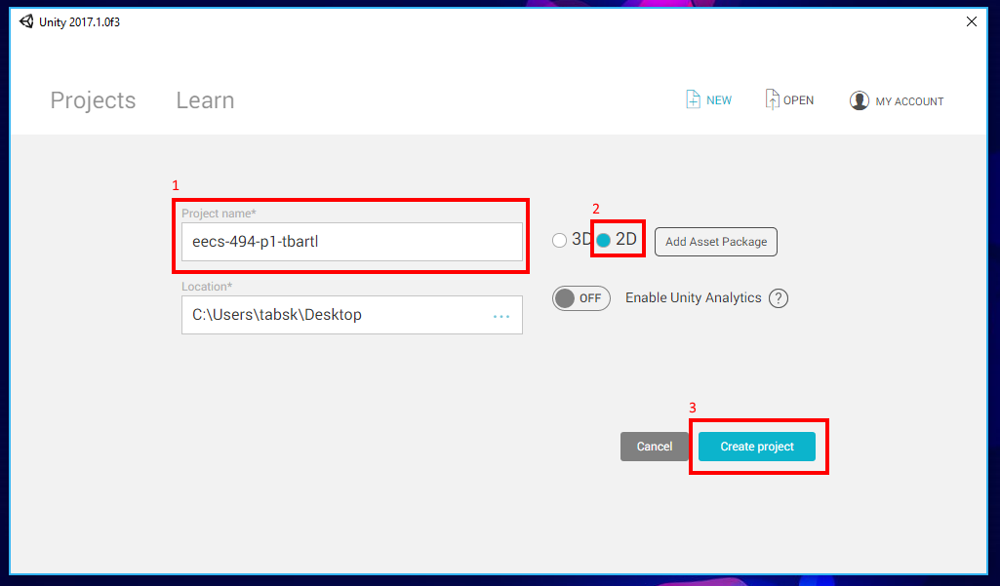

## Project and Scene Setup

For any game you'll create in this class, the first thing you're going to need to do is **setup the project** with **version control** and setup your first **scene**. You may find it helpful to **come back to this page** on future projects as a reference.  

### Creating the Project

Open Unity and click the "New" button to create a new project.

On the next screen give your project a name. It should follow the format "eecs-494-p1-\<uniqname\>" where \<username\> is your uniqname.

Next select 2D as Metroid is a 2D game. This ensures that whenever a scene is created, it is setup specific to be 2D.

Finally hit "Create project" to, as the name suggests, create the project.

After Unity finishes setting up your project, you will be greeted with the Unity Editor.

### Importing Unity Packages

Unity packages contain a number of assets that you can use in your game. Unity provides a number of standard asset packages that you can use for free, and you can also find many on the Unity store. You may want to experiment with some of these in your own games.

For this project, we wil be using a Unity Package the instructors have created that contains everything you'll need to get your project going. However, this is not a complete set of assets you'll need for your project; you'll be responsible for finding any other assets you need.

First download the Unity Package from the [canvas website](https://umich.instructure.com/courses/164929/files/folder/p1). You can find it in the "Files" tab inside the "p1" folder with the name "494-p1-templatePackage.unitypackage".

