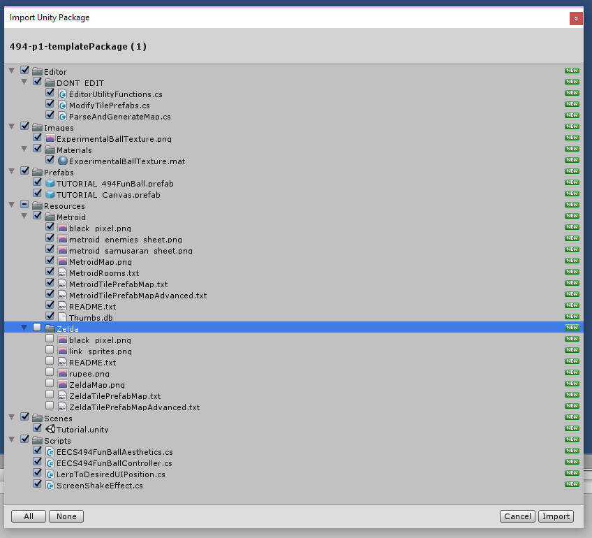

## Project Setup

For any game you'll create in this class, the first thing you're going to need to do is **setup the project** with **version control** and setup your first **scene**. You may find it helpful to **come back to this page** on future projects as a reference.  

### Creating the Project

Open Unity and click the "New" button to create a new project.

On the next screen give your project a name. It should follow the format **"eecs-494-p1-\<uniqname\>"** where \<uniqname\> is your uniqname.

Next select **2D** as Metroid is a 2D game.

 
  
Regardless of which option you select, your game will still build and play the same.

  
The difference between the two is that some settings will default to different things. With 2D set cameras default to orthograpic instead of perspective, images default to sprites instead of textures, and backgrounds are set to a solid color instead of a skybox to name a few.



Finally hit **"Create project"**.

After Unity finishes setting up your project, you will be greeted with the **Unity Editor**.

### Importing Unity Packages

At any point when developing your project you can import a Unity Package to your game. For this project, we will be using a Unity package the instructors have developed to jump-start the project. 

 
  
Unity packages are a collection of Assets that you can import into your project

  
What separates Unity packages from simply dragging in your assets is that Unity packages support meta data. This means that settings on things like textures will already be setup correctly. It also means that a Unity package can have Unity specific assets like Prefabs, Scenes, and Materials.



First download the **Unity Package** from the [canvas website](https://umich.instructure.com/courses/164929/files/folder/p1). You can find it in the "Files" tab inside the "p1" folder with the name "494-p1-templatePackage.unitypackage".

Once downloaded **double click** the .unitypackage and it should open up into your current Unity project.

A list of assets will appear. From here you can choose what you want and don't want to import. In this case, we don't want the Zelda assets so feel free to uncheck those. Once that's done hit **Import**.

Thanks to the Unity package, we now have a number of new assets in our project. It isn't important to know what all of these are right now, but as we go through the tutorial we will use all of these.

Note that this isn't a complete set of assets that you'll need for your game, it's up to you to find the rest!

 
  
Unity provides a number of standard asset Unity packages that you can import by simply going to "Assets" tab and selecting "Import Package".

  
For the sprites you'll need, you can check out <a href="https://www.spriters-resource.com"> spriters-resource.com</a>. However, note that there needs to be special care to import any images into your project; we'll cover this in the next section.

  
For the sound effects you'll need, you can check out <a href="https://www.sounds-resource.com"> sounds-resource.com</a>



 
  
Unity provides a number of standard asset Unity packages that you can import by simply going to "Assets" tab and selecting "Import Package".

  
In addition, you can find many unity packages, both free and paid, on the Unity Store.

  
For this project you won't be required to use any other unity packages, but in future projects you're free to explore some of these.



### Setting up version control

Before we initialize a **git repository**, we need to configure our project settings to be compatible with version control.

We do this by going through **Edit->Project Settings->Editor Settings** and settings **Version Control Mode: Visible Meta Files** and **Asset Serialization Mode: Force Text**. Note that some of these settings may already be defaulted for you.

We'll also need a **.gitignore**. You can find one online <a href="01/gitignore.txt">or just use this one (remember to rename it to ".gitignore" though!.</a>

Once you have one, drop it into the **root** of your project (next to your Asset folder, ProjectSettings folder, etc...).

 

Unity maintains a huge amount of files so that your poject doesn't need to be rebuilt in full every time you load or run it. The only things you actually need for your Project are everything in your Assets and Project Settings folder, the rest doesn't need version control.

Plus it would be really hard to work with version control if you were committing a lot of extra files you hadn't changed.



Next we need to set up our repo online. In this case we will be using <a href="https://gitlab.eecs.umich.edu/">GitLab</a>. Create a new project, give it a fitting name and **make sure the repository is set to private**.

Once it's setup GitLab will have further instructions on setting up the project. As we already have a project, follow the instructions for an **existing folder**.

 

If you've never worked with Git before it shouldn't be a problem. All you'll need for these tutorials is the basics, so any quick online tutorial should get you caught up.



### Disable Anti-Aliasing

The last thing we need to do for our project is disable anti-aliasing. Go to **Edit->Project Settings->Quality**. Unity defaults to having 6 quality options that users can choose between, so we'll need to update all of them. Set **Anti Aliasing** to **Disabled** for all settings.

 

For higher performance games, it's important to give your users users some means to adjust their settings. For an old-school NES game this really isn't necessary, but it's a bit of a hassle to setup a single quality.

If you want to do this though, you're welcome to do so for this project.



### Conclusion

And that's it for this section. When you're ready to move on, go to [02-Scene Setup](./02-SceneSetup).