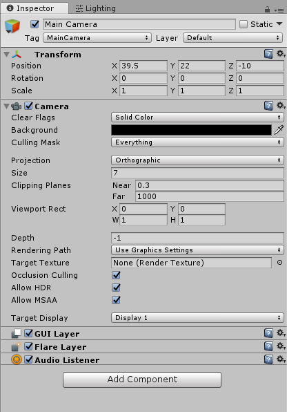
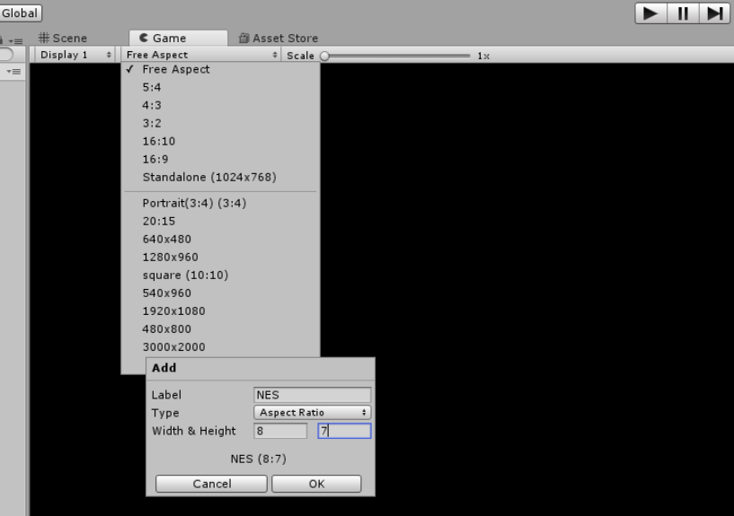

## Scene Setup

To create a new scene, go to **File->New Scene**. By default Unity will start you in a new scene when you create a project.

Save the scene with a name like **Main** to your Scenes folder.

 
  
You'll definitely want another scene for your custom level. You may also want some additional scenes to test various enemies and features as well instead of spending up to 5 minutes playing to get to them.



### Camera Configuration

The first thing we'll want to do is setup the camera, **Main Camera**, that was included when we made the scene.

Set the **Clear Flags** to **Solid Color**

 
  
In the rendering process, elements are drawn on top of each other each frame. The clear flags determine the first layer that will be drawn, in other words it's the canvas that everything else is painted on top of.

  
In Metroid the background is a solid black, but in a 3D game you may want a skybox instead.



Set the **Background** to **Black**

Ensure the **Projection** is **Orthographic** 

 
  
Projection determines how the camera interperts objects in space.

  
For perspective, the camera trys to bend shapes with a Field of View and give an element of depth to the scene. This is most useful in 3D games

  
For orthographic, elements are rendered as is regardless of their depth. This is most useful in 2D games like Metroid.



Set the **Size** to **7**

 

The size corresponds to half the vertical view. Since Metroid shows 14 tiles vertically, we want 14/2=7 as our size.



Set the **Position** to **(39.5, 22, -10)**

 

It's going to be where our player starts. It just helps to set it now.



### Aspect Ratio Configuration

Our view isn't quite ready yet. Right now our game is defaulting to a **Free Aspect** ratio, but we want it to display at the NES's **8:7 Aspect Ratio**.

Open your **Game Tab**. Click where it says **Free Aspect** and then click the plus near the bottom of the window that popped up. 

Set the Label as **NES**.

Set the type as **Aspect Ratio**

And set the **Width & Height** to **8 & 7**

And that's it for setting up our scene! Now we can finally get to adding content to the scene. When you're ready, commit your changes and then head over to [03-Placing Tiles](./03-PlacingTiles).