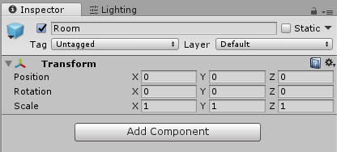

## Tile Placement

Before we can begin setting up our player, we need to **set up our basic environment**. In the case of Metroid, this means getting all of the **tiles into our scene**.

Traditionally, students would be required to painstakingly place every tile in their classic game by hand. Thankfully we have developed some **editor tools** to do this for you.

 

Unity editor tools are scripts that can run while the game isn't playing.

Unlike the usual scripts you'll be writing in class, editor scripts have access to extra functionality that allow them to change the contents of your scenes, assets in your project, and even your project settings.



These editor tools can be found under the **494 dropdown** at the top of your editor (they came with the unity package!)

### Running the "01-ParseAndGenerateMap" Script

The first script that we'll be using is **01-ParseAndGenerateMap**. As the name suggests, this script is going to do most of the work in generating the map.

To begin, open the 494 dropdown and click the name "01-ParseAndGenerateMap" to open the window.

Next we need to **supply arguments** in the window before the script will run.

* For the **Input Map Texture**, supply the **"MetroidMap.png"** image that was included in the UnityPackage". You can find this under the **Resources/Metroid folder**.

* For the **Game**, change it from Zelda to **Metroid**. You should now see another parameter "Room Groupings".

* For **Room Groupings**, supply the "MetroidRooms.txt" that was included in the UnityPackage". You can find this under the **Resources/Metroid folder**.



In Zelda, all of the Rooms are a fixed size so it's possible to figure out rooms automatically. In Metroid, the rooms are variable size so we have to provide a bit of information about the rooms.



Finally hit run and after a few seconds you'll see your scene fill with tiles. You may need to move your scene camera: double-click the **Level** Game Object in your hierarchy.

### Results of the  Script

Now let's analyze the **results** of this script. First let's look at the new **Assets** that were created in the **"_GenerateAssets"** folder.

**TileSpriteSheet.png**: Is a texture that was generated by the script. It serves as a Sprite Sheet that all of the Tile objects are linked to for display.

 

Yes, and it will be important to understand this so you can setup any textures you import in the same way.

It is setup as a Sprite Sheet. Sprite Sheets are collections of sprites compacted into a single file (it would be obnoxious having ~30 different tile assets in your project). Using the Sprite Editor, you can set how these sprites are separated. You'll likely need to use the Sprite Editor yourself when you start importing your own assets to this project. 

The Pixels Per Unit (or PPU) is set to 16. This means that 16 pixels will count as a single unit for this texture. If you're confused by this, try increasing or decreasing it to see how it changes your tiles. Note that by default Unity will set your PPU to be 100, so you'll need to change this for any texture in this project!

The Point Filtering is set to clamp. With higher resolution textures you'll often want to blur between each pixel so that the texture appears smooth. In a pixel game like Metroid, you want these pixels to be preserved and no blurring to happen. If you want to see the difference, try setting this to Billienar and observing the results. Note that by default it will be Billienar, so you'll need to change this for any texrture you import.



**Tile_NONE.prefab**: Is a prefab that all of your tile Game Objects in your scene are instances of.

 

A prefab is an asset that lets you create many instances of Game Objects that all share the same properties.

Instead of updating all of the tiles one at a time, you can just update a prefab and all of the tiles in your scene will update.



 

Once you have an instance of a prefab in your scene you can make changes to that single instance manually. Unless applied, these differences will only be reflected for that single instance. Also, any changes to the prefab that change that property won't overwrite the manually modified property unless it is reverted.

In this case, the script manually set the Sprite property of the SpriteRenderer component to be different for every Tile.

It's not just the sprite they differ by, but also the position.





Over the course of this project you will need to create more Tile prefabs to accomodate different tile properties. These include things like Doors, Breakable Blocks, Lava, and more.

To start, all of the tiles will be instances of the Tile\_NONE prefab as this prefab has no properties. Soon we'll create Tile_WALL for all of the Tiles that act as Walls.



**Room.prefab**: Is a prefab for Room Game Objects. Right now all rooms do is hold your tiles, but in the future it will also hold collectables, hold enemies, and possibly manage room transitions.



Right now it has no special properties. In the future you may want to update all of the rooms to do something special, like manage the camera position or room transitions. In this case you'll want a way to update all of the rooms at once.

You may find that in your implementation this stays empty and that's OK as long as your game is functioning correctly.



Now that we understand the assets created let's look at the **hierarchy and scene view**.

In your hierarchy you'll notice a single empty **Level** GameObject. This is mostly just for **organization** so that the content of your level stays separate from other things like UI or Game Managers that you'll be adding later. 

Next we have all of our Rooms. Right now these just holds the tiles, but as you add enemies and collectables make sure they go under the correct room!



If you want to **disable** these rooms (which you'll need to do for performance reasons), you'll want to make sure that your enemies are also disabled as well so they don't just fall into empty space. By placing everything under it's correct room you can disable all of the child tiles and enemies in one shot!

It also just makes things a bit more organized.



And within each of these Rooms you'll see all of the **tiles**. Each tile is a separate **Game Object** that currently just has a SpriteRenderer component.

### Conclusion

Everything looks good, but unfortunately these tiles don't actually have any **properties**, no collision or anything! You can observe this by dropping in the EECS-494 funball and using the arrow keys to try to bounce off the walls; the ball goes straight through them!

Next we're going to add some basic properties, but first...



Yes, and it is your job as a Game Developer to make sure your game is reasonably optimized. In this project, you'll need to make sure that rooms that aren't in use are disabled.

BY THE FINAL BUILD, YOU SHOULD ONLY HAVE AT MOST 2 ROOMS ENABLED AT ANY GIVEN TIME. We WILL be checking this and marking points off it's not done.

You will already need to develop some concept of what room the player is in while making camera controls so this shouldn't be too much extra work.

For now however most machines are powerful enough to have all of these objects in the scene with out a problem (partially thanks to Unity's optimization of off-screen objects).



It's important to note that what this script did **could have been done by hand**. There is **nothing special** about the scene at this point, and **you can make any changes** you see fit to the scene.

Finally, note that **this script should only ever need to be run once**.



There are very few cases in which case you'll want to rerun the script. However, in the instance that you didn't save your scene, for example, you'll need to **delete all of the generated assets** from your assets. This includes the Sprite Sheet, the Room prefab, and any Tile prefabs you have.



In the next section we'll be adding properties to many of the tiles. When you've committed your changes and are ready, click here to go to the next section: [04-Configuring Tiles!](./04-ConfiguringTiles)