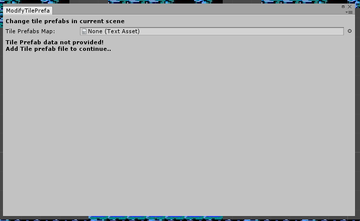
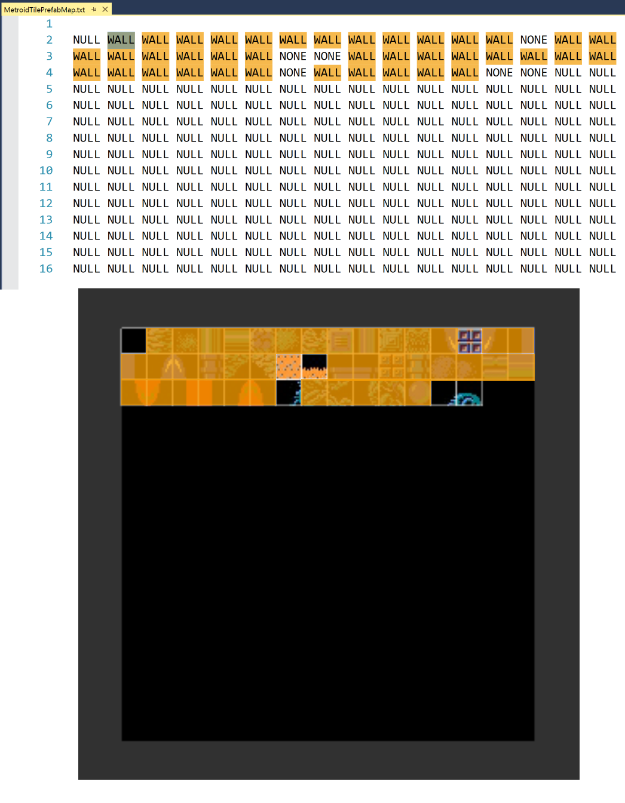
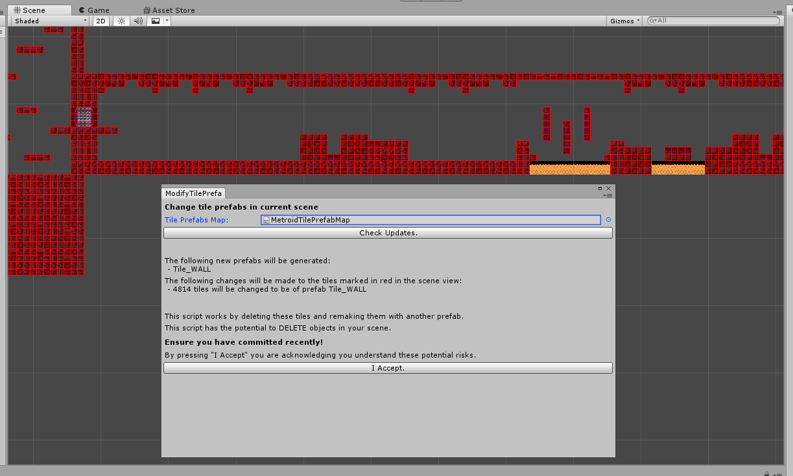
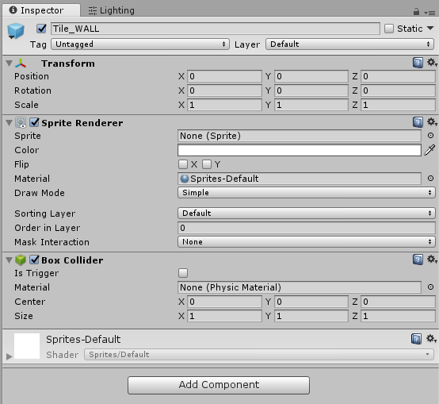
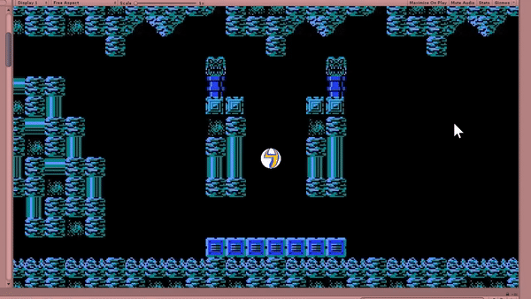

## Configuring Tiles

As mentioned in the last section, our tiles only look nice, but they **aren't setup** to function correctly.

In this section, we'll show you how to **make new Tile prefabs** and **update your prefabs** to have **new properties**.

### Running the "02-ModifyTilePrefabs" Script

The second script that we'll be using is **02-ModifyTilePrefabs**. As the name suggests, this script's function is to update all of the tiles in our scene. Specifically, it can change the prefab of the tiles in the scene.

Open the window just as you did with the other Editor Script.

This script takes just a single parameter, **TilePrefabMap**, which you should supply with the included **TilePrefabMap.txt** under the Resources/Metroid folder.

This text file contains a map from the **Sprite Sheet** to what the prefab should be. You should open up the file to understand this relationship a bit more.

Hit the **Check Updates** button. The window will tell you what's happening:

The window is telling us it's going to make a **new prefab, Tile_WALL**, and **update** ~5,000 of the tiles to use this.

In fact you can click on the scene to see which tiles are getting updated. As **most tiles are walls**, this is almost all of the tiles but you should notice a few exceptions with things like lava.



Yes! In fact, we encourage you to do so!

As you find more tiles you want to replace, you simply have to update your TilePrefabMap.txt file and rerun the script. This can be very useful if you want to convert lava, doors, breakable blocks, and more over.





Technically, if you wanted to do this yourself you could. The editor script just created a new prefab (easy) and re-created all ~5000 appropriate tiles in the scene with this new prefab (very time consuming).

While you definitely want to avoid doing this manually for a large number of tiles, there may be times where you'll find manually changing a few tiles is OK. For instance, you may decide that having doors as three separate tile game objects is hard to maintain logic-wise, so instead you just replace those tiles with a new Door prefab.

If you do decide to change the prefab of a tile manually, make sure the the prefab name does not start with "Tile_" or your changes may be overwritten if you run this script again.



### Updating a Tile Prefab

Now we have two separate Tile Prefabs: **Tile\_NONE** which correctly has no properties, and **Tile\_WALL** which is supposed to be solid, but also has no properties.

To add collission, we will be giving the **Tile\_WALL** prefab a box collider. In the inspector for the prefab, click **Add Component** and add the Box Collider. Thankfully this collider is already the right size and position, so we don't need to change anything else.



It is true that a Rectangle Collider (and all 2D physics) may be more suited for this game.

Each physics system has its own functions and components to worry about. Learning both can take a lot of time, so we decided to just teach one in this class. With 3D physics, you can still implement 2D physics but with 2D physics you can't implement 3D physics.

If you want, you're welcome to try to learn 2D physics for this project! Just make sure to make the appropriate changes.





Unfortunately while making these tutorials we stumbled across a new bug introduced in Unity 5.6. This bug causes updates to nested prefabs to take a really, really long time (previously this took just half a second but now it can take up to a minute for both changing the prefab and saving the scene after).

Unfortunately, there's really not a good workaround that would preserve the workflow we want to use. This bug is only noticable when you update Tile_WALL as there are far less of any other tile you'll be using, and Tile_WALL shouldn't need that many changes.

For now we hope waiting for this isn't too much of an issue. If you wait for ~10 minutes and it still isn't working let the instructors know and we may be able to help

<a href="https://issuetracker.unity3d.com/issues/prefabs-update-causes-unity-to-freeze">If you want to get this bug fixed, you can vote for it here!</a>


### Conclusion

And that's it! We just had to make a change to the one **prefab**, and all of the **instances** in the scene updated. This is the workflow you should use for configuring all of your tiles.

When you've committed and you're ready to go, head over to [05-Player Setup](./05-PlayerSetup).