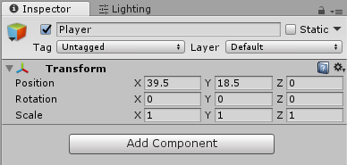
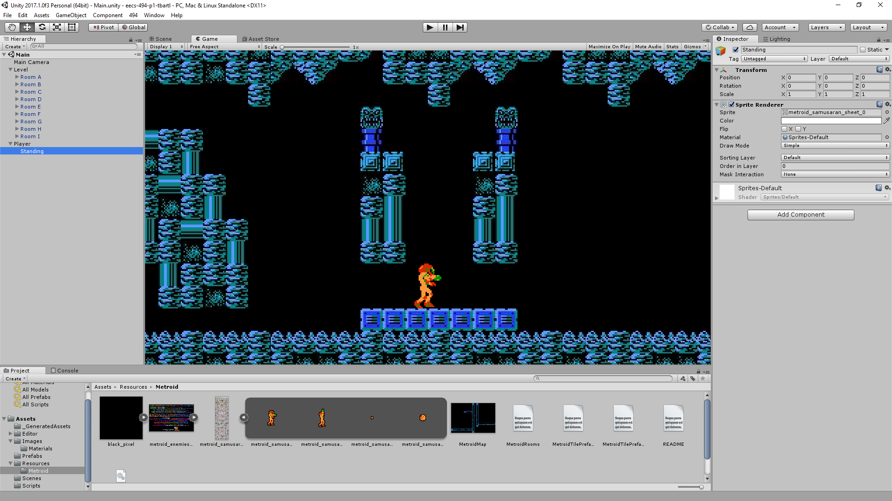
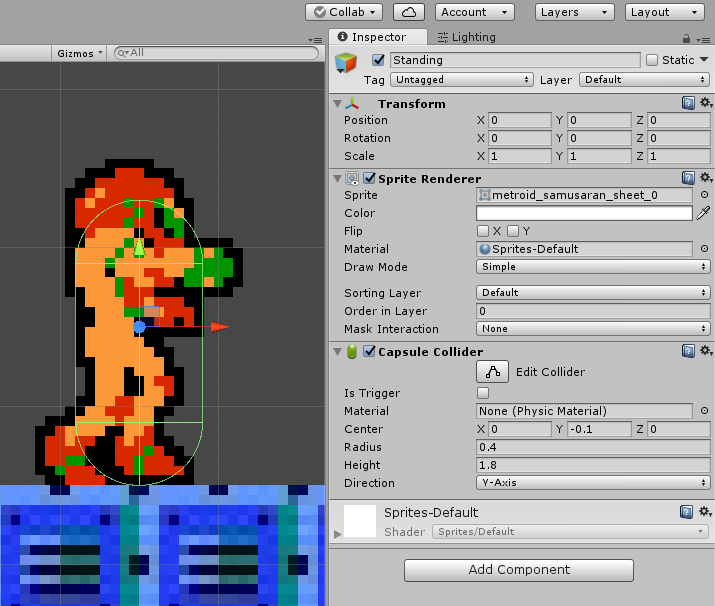

## Player Setup

Now that we have our level (mostly) setup, we can add start working on the **Player Game Object**: Samus.
Create a new **Game Object** and give it the name **Player**.

## Player Root Object

Set this object's position to **(39.5, 18.5, 0)**.

Also get rid of the Fun Ball if you haven't already.



Samus is special in that she can move between rooms. Enemies on the other hand need to be children of the room so that they are disabled with the room once the Player exits it.



## Player Standing Object

Next we're going to create another Game Object named **Standing** and set it as a **child** of **Player**. Set the **local position** of this object to **(0, 0, 0)**.

Now add a **Sprite Renderer** component to the **Standing** object. Set the **Sprite** of this component to **metroid\_samusaran\_sheet\_0** under the **Assets/metroid\_samusaran\_sheet** Sprite Sheet



Samus has a number of different states that she can be in, and by separating these states into separate Game Objects we can more easily control the logic of our game.
 

While Samus is standing, she can jump, she can shoot, and she's two tiles tall.

While Samus is a ball, she can bounce and she's one tile tall.

You could try to program all of these differences (and this is how the project was approached in the past) but it's easier to just handle it by keeping just one Game Object active.





One of the main reasons is purely for organization. Instead of trying to maintain a bunch of objects floating around in the scene you can group objects under a root object.
 

Setting an object as the child also means that as the parent moves, the child will move with it.

Deactivating a parent will also deactivate the child (which is how you will disable enemies with the room).

There's a lot more to it than that. For example, colliders of children work with the rigidbody of their parent. These kinds of things you'll just become more familiar with as you work with Unity.





Global position is where the object actually is.

Local position is where the object is relative to its parent's position and orientation.



Next let's add a **Capsule Collider** to **Standing**.

Set the **Center** to **(0, -0.1, 0)**

Set the **Radius** to **0.4**

Set the **Height** to **1.8**



It's true that a Box Collider is more representative of what the real Metroid would use. However there is a reason for this that we will talk about extensively in 07-Addressing Movement Concerns





It's really up to the programmer. Some people prefer to have the bottom of the object represent where the player is and move the Sprite Renderer and Collider up.

This can make some things easier such as checking how far the player is from the ground, but can be worse for things like determining how far the object is from other objects.

It's important to pick one way and stick with it, in this case our root will be at the center of the object.



While a **Collider** was all that was needed for the **Tiles**, the Player also needs to move. For that we'll need a **Rigidbody**.

Add a **RigidBody** to the **Player** Game Object.



For the different states we'll want different colliders. While Standing Samus is 2 tiles tall but in ball form she's just 1 tile tall.

However, these states share the same movement. It would be pretty odd for the velocity to change every time you went between states.



Finally, drag-and-drop the root **Player** Game Object from the scene into your **Assets** to make it a prefab. Move it into the Prefabs folder for organization.



Even if there will only ever be one Player Game Object instantiated, you want to make sure that the Player in this scene stays up to date with the Player you will add to other scenes (like the Custom Level).



That's it for this tutorial. Once you're ready commit your changes you can move on to [06-Player Movement](./06-PlayerMovement).