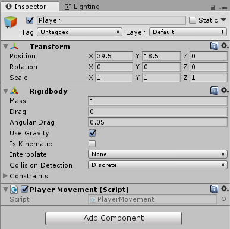
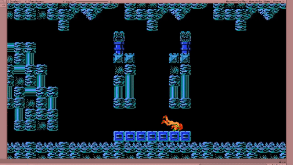

## Basic Player Movement

We're finally ready to start writing some code! Create a new Script **PlayerMovement.cs** in your scripts folder. Add this to your **Player** prefab (or to the one in your scene, but make sure to **apply** your changes at the end!)



No no no no no!

One of the most important concepts of Unity is having your components as small and specialized as possible! This will make your code a lot easier to maintain and much more reusable

While the reasoning is a little less obvious for the Player, it is obvious once you start thinking about it in terms of an enemy

The Zoomer can Crawl, deal damage to things it hits, take damage, die, and drop collectables.

The Skree can Drop down, deal damage to things it hits, take damage, die, and drop collectables.

If you just had two separate scripts for these, you would end up rewriting all of the code except for movement. Not to mention how confusing it would be having one ~200 line solution instead of four ~50 line solutions

But seriously, in the past we've seen people come in with a single Player.cs script that's over 2000 lines long. Don't be one of those people.



First add a new variable to store a reference to the **RigidBody**. In Awake() set this using **GetComponent()**.



GetComponent is one of the most useful functions an object has access to. This is, and related functions, is how your scripts should communicate Unity's components (Rigidbodies, colliders, renderers, etc...) and with your own scripts.

Many students have trouble at first knowing when to use GetComponent(). Instead of using it they either write everything into one big script or use a lot of static variables. Don't do this or your code will quickly become unmaintainable.





Calling GetComponent is a relatively expensive operation, and doing it every physics update can cause some performance issues.

In fact, you used to be able to do gameObject.rigidBody. However this has been deprecated as many newbies didn't realise that this was calling GetComponent behind the scenes.

The one exception to this is the Transform component. You can always call gameObject.transform and it will be pre-cached for you.





Partially because it makes sense for me to think about it as a function of the object itself rather than some global function, but mostly because it makes the auto-complete come up a bit faster :).



### Horizontal Movement

We are also going to need a **public float** to control the player's move speed. Set its value to **5** for now.



This is a game, not rocket science. We don't need that kind of precision here!

Plus there are very, very few instances where built-in Unity code uses doubles.





In addition to their traditional use, public variables also make a variable visible and changeable in the Unity inspector.

This is preferred for things like Movement Speed that we may want to play around with, while a Rigidbody isn't something we want to manually set ourselves.

As an alternative to using public, you can also use the attributes [ShowInInspector] and [HideInInspector].



Now that we have access to the **RigidBody**, we can update the **rigid.velocity**. Set a new **Vector3** equal to the current velocity. Update the x component of this to be equal to the Input on the Horizontal axis multiplied by the move speed.



Input.GetAxis() returns a float from -1 to 1 for current along a given axis. The strength of this compared to calling individual keys is that it works regardless of whether you're using a controller, or a keyboard. Plus users can rebind these keys if they want to.





Under the hood, there is often times a good bit of extra work every time one of these variables is set. For instance, if you set transform.position to a new value, Unity has to update all of that object's children, colliders, renderers, and more.

To encourage reducing this work, Unity forces you to update it all at once instead of by x, y, and z.



### Vertical Movement

The first thing you may think to do is add gravity. However, Rigidbodies default to having gravity by default.



You can either set the object to not use gravity then implement the downwards acceleration yourself, or change it in Edit->Project Settings->Physics.



But we still need to add jumping. Just as you did with moveSpeed, make a public **jumpPower** variable and set it to **15**.

Next check for the **A** key being pressed and set the velocity to the **jumpPower** when this happens.

### Conclusion

And that's it for movement, run your game and you'll see that... there are a lot of problems...

But that's OK because in the next tutorial we'll be going over how to fix these problems. When you're ready commit your changes and go to [07-Player Movement Fixes](./07-PlayerMovementFixes).