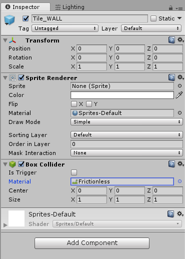

## Player Movement Fixes

A very large portion of the time you spend in this class will be researching bugs like the ones we have with out movement. For this tutorial, we will show you how to fix some of these bugs.

### Constraining the Rigidbody

The most noticable problem is the spinning. We could try to force the character upright through scripting, but it's easier to do so through the **Player**'s **Rigidbody** component.

Under **Constraints**, freeze the **rotation** on **every axis**.

While we're here, also freeze the **position** the **z-axis** so the character doesn't move back in space. You should do this with all of your **Rigidbody**s for this project.

### Input Manager Fixes

You may have noticed the player **gradually speeds up** instead of starting with **full velocity**. This is because by default Unity tries to mimic joystick controls for **Input.GetAxis**, trying to smooth out changes between the keys. 

o to **Edit->Project Settings->Input** and set the **gravity** to **inf** and set the **sensitivity** to **inf**.

### Physic Materials

You may have noticed the player **sticks to walls** if you hold the direction into them. This is because there is a lot of **friction** from the horizontal force keeping Samus up vertically.

**Friction** is sometimes a good thing, but in Metroid we have no need for it.

Create a new folder in your **Assets** named PhysicMaterials. Inside of it right click anywhere and do **Create->Physic Material**. Name it **Frictionless**

Now set the **Dynamic Friction** and **Static Friction** to **0**.

Set this as the **Material** for the **Capsule Collider** of **Standing** (the child of **Player**).

Also set this as the **Material** for the **Box Collider** of the **Tile_WALL** prefab.



It would seem like a box collider would make more sense here. However, the collision in Unity is unfortunately not ideal for Tile based games.

Essentially how the collision works is that each physics update, the rigidbody object moves its velocity. Then it is pushed out of anything it moved into. Unfortunately, it may get pushed out of the sides of a tile before it gets pushed out of the top/bottom of another tile. This could cause the player to stop and get stuck, but having a round bottom "fixes" this.

Unfortunately this isn't the only problem Unity's physics causes. You may notice the player bounce slightly, and even still get stuck on walls at intersections between tiles. This is one of the problems you'll need to figure out while polishing this project

You're two most likely options are to either:

 A: Check if the player is going to run into a wall and stop the velocity in that direction if they are (you can do this through Box Casts).

 B: Implement your own predictive movement, moving your character up to the velocity in both axises but stopping if it's going to hit an object.

This isn't something you should concern yourself over too much right now, but if you need more help in the future be sure to come talk to us during office hours.



### Checking Grounded

The last thing you may have noticed is that the player can still jump while airborne. Let's check to see if the player is **grounded** before we let them jump.

Create a new function **IsGrounded()** that returns a **bool**. In it, SphereCast from the **child**'s **collider**'s center down to just below the bottom of the collider. 



SphereCasts, like RayCasts, allow you to check if there's anything in the way along a path. They are most common in First Person Shooters where you'll want bullets to travel instantly.



Now just add the **IsGrounded()** check before you jump.



Yep! This is something you'll probably want to fix at some point. Hint: Use LayerMasks



### Jump Strength

Now that we're able to actually play our game, you may have noticed that we went a little overkill with our initial **jump strength**. You can just go ahead and dial this down to **12** in the editor, no need to change your script!

### Conclusion

This was only the **basics** of movement and you'll find in your analysis that there's a bit more to Metroid than just this (running jumps, jumps dependent on how long you hold the button, etc...). However that's all the time we're going to spend on it here.

When you're ready, commit and go to the next tutorial: [08-Player Direction](./08-PlayerDirection).