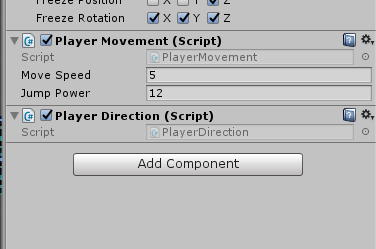
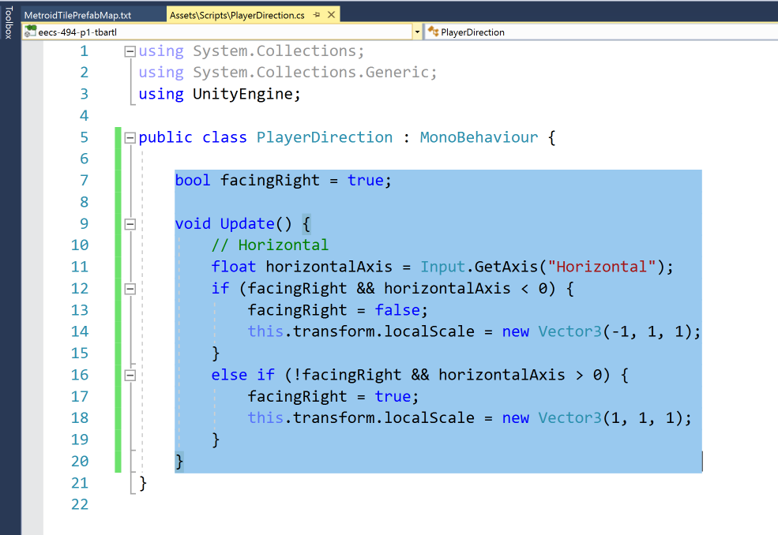
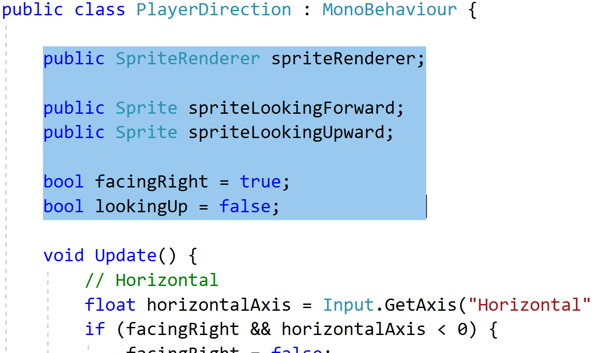
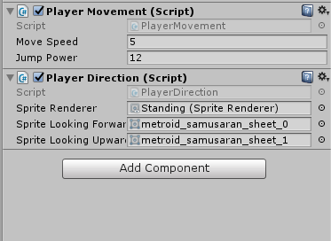
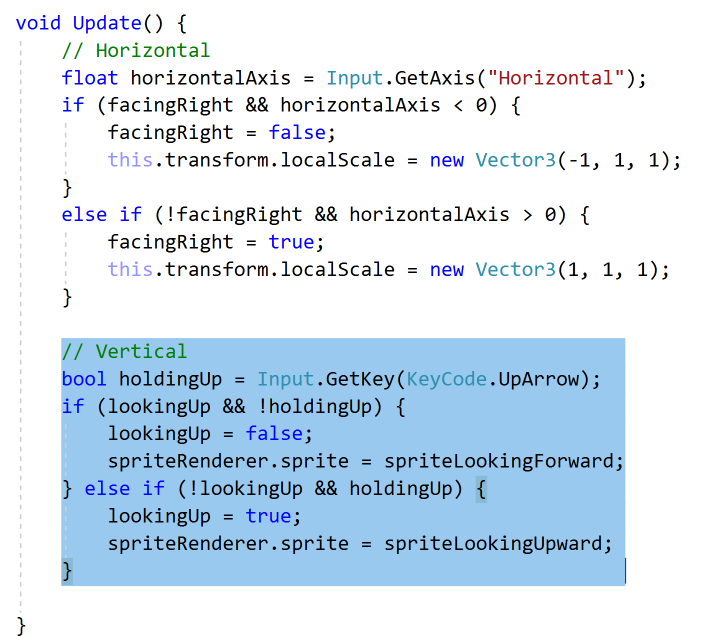
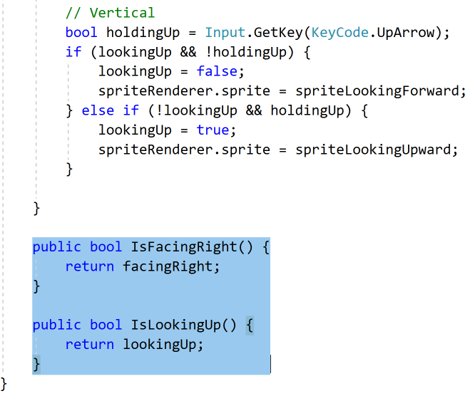
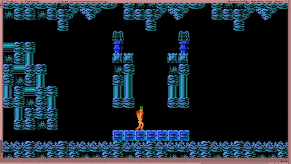

## Player Direction

The next thing we'll want to do is to have the player face in the correct direction. This is important not only for **aesthetics**, but to make sure the player can **fire in the correct direction**.

To start, create a script in your **Scripts** folder called **PlayerDirection.cs**. Add it on your **Player** prefab.

### Horizontal Direction

To control how the player looks left and right, we're actually going to just **flip the object** by scaling negative on the **x-axis**. Not only will this make it easier for us as we don't have to have Sprites for both directions, but it will also help with some logic later for determining where the gun should fire from.

In your **PlayerDirection.cs** script add a **bool facingRight** that defaults to true. Next add two conditionals for if the input direction is different than the current direction. When these conditions are met, **change the direction** and **flip the character**.

### Vertical Direction

Next we want to do something similair for if the player is facing up. In this context, facing up is aiming the gun up. Unfortunately we can't just flip something over, we'll have to update the actual sprite used.

Add a **bool lookingUp** that defaults to false. However we still need Sprite specific variables, so add a public **SpriteRenderer** and two public **Sprite**s for facingForward and lookingUpward.

Now we need to set these back in the inspector. The **SpriteRenderer** needs to be set to the the SpriteRenderer attached to the child **Standing**. You can either open up and lock a second inspector, or simply drag the **Standing** GameObject onto the spot and it will use it's **SpriteRenderer**.

The two sprites are simply **metroid\_samusaran\_sheet\_0** and **metroid\_samusaran\_sheet\_1** respectively.

Now we just need to write our logic, much the same as before. The one difference is that the player doesn't need to press down to look down, so instead we'll just check if the **up key** is held so.



Yep! This is more of polish, but it wouldn't be too hard to either use Unity's Animator or implement your own to loop through a list of sprites instead of a single sprite for each state.



### Public Functions

The last thing we'll want to do is expose the current direction of the player. This is important so that other scripts we are about to write can access this information. Simple **Getters** will do.



You could have, but then you run the risk of something else being able to change the variable without you knowing. You may say "But the only people who could do that is me or my partner, and we would never do that!".

This may be true, but none of us are perfect, and our bugs come from when we unintentionally make mistakes like that.

Of course, the same can be said about all of the other variables that we've made public. The difference is that when a change happens to those we'll know about it as it will be reflected in the inspector.



### Conclusion

We now have the ability to look and aim our blaster. Of course, no blaster is complete without firing and in the next tutorial we are going to implement exactly that.

When you're ready, commit and go to the next tutorial: [09: Bullets And Firing](./09-BulletsAndFiring).