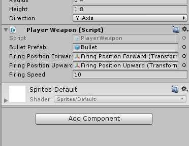

## Bullets and Firing

Now that we have directions and aiming, we can start working on implementing the shooting.

### Bullet Setup

Before we add functionality to shoot, we need to first create the bullets Samus will be shooting.

First create a new **Game Object** named **Bullet**.

Give it a **SpriteRenderer** component with **Sprite**: **metroid\_samusaran\_sheet\_2**.

Give it a **SphereCollider** component with **IsTrigger**: **True** and **Radius**: **0.2**

Give it a **Rigidbody** compontent with **Use Gravity**: **Off** and the same **Constraints** as the Rigidbody on **Player**.

Now let's make it a **Prefab** by dragging it from the **Inspector** to our **Prefabs** folder. Delete the **instance** from the scene.

### Firing

Now we need to let the player shoot the **Bullet prefab** on a button press. Create a new script **PlayerWeapon.cs** in your **Assets/Scripts** folder and add it to your **Standing** Game Object (the **child** of **Player**).



The player only has the ability to shoot while they aren't in ball-form. Once we start disabling Standing, we can also correctly disable the Player's ability to shoot automatically as Components of Game Objects are disabled with the Game Object.



Now let's set up some of our variables we'll need.

We need to store a reference to our **PlayerDirection**.

We need a **public GameObject** for our **bulletPrefab**.

We need two **public Transform**s. One for **firingPositionForward** and one for **firingPositionUpward**;

We need a **public float** for the **firingSpeed**. Set this to **10** for now.



As the name suggests, this is going to be the position from which the player fires from. While you could try to code the offset it's much easier to just have an empty child Game Object and use that position. Part of this is because the position of this child will update when the player flips around.





If you wanted to, you could store your firing positions as Game Objects and just call "firingPosition.transform" instead. However typing that all out is a bit of extra work and it makes more sense to use only what you need: in this case access to the transform.



We now have four **public** variables that we can set in the inspector and one implicitly **private** variable that still needs to be setup. Let's setup that private variable (**playerDirection**) now in **Awake**. Note that we need to use **GetComponentInParent()** instead of **GetComponent()** as the **PlayerDirection** script is attached to **Player**, not **Standing**

Before we can set the other variables, we need to actually create the firing positions. 
Create two new empty Game Objects, **Fire Position Forwards** and **Fire Position Upwards**. 

Set both as **children** of the **Standing**.

Now set the **local position** of both to **(0.665, .365, 0)** and **(.125, 1.25, 0)** respectively.

Now that we have our firing positions, we can add references to their **Transform** in the inspector.

Let's also add a reference to the **Bullet prefab** we created.
We don't need to do anything with **firingSpeed** right now as we already set that in the script.

Now that our references are set up, we can start writing the actual firing code.
This code will be pretty simple: in an **Update** check if **Input** is down for the **S** key. When the button is pressed create a new **instance** of the **Bullet prefab**.

Depending on the **playerDirection** set set the **position** and **velocity** accordingly.

And that's it, our player is now firing... infinitely lasting bullets.

### Destroying Bullets
If you run your game you'll notice that our **Bullet**s never get **Destroy**ed; they exist forever. There are two ways that bullets should be destroyed, so let's create **two scripts**, one for each case.
The first reason a **Bullet** should be **Destroy**ed is after a short period of time. Create a new script **DestroyOnTime.cs** and add it to the **Bullet** prefab. As the name suggests, all we need to do here is **Destroy** the object after a some time. We can easily do this by supplying an optional parameter to **Destroy()**.

In the **Inspector**, let's give the **public destroyTime** variable a value of **TODO**

Why didn't we set the float in the script like we usually do?

With previous scripts like the ones written for the Player, the script was only really applicable to a single Game Object. For a script as general as this though, we can use it for a lot of different things if we leave the implementation vague.

The other reason a **Bullet** should be **Destroy**ed is when it hits something. Create another new script **DestroyOnTriggerEnter.cs** and add it to the **Bullet** prefab. Again, this script is pretty simple: it should **Destroy()** the object **OnTriggerEnter()**.
What is OnTriggerEnter()?

This is one of the many functions Unity will call when something with physics happens. As the name suggests, this takes place when a Trigger collides with something else

One major thing that separates this from OnCollisionEnter() is the parameter. Note that with OnCollisionEnter() you get a Collision, but with OnTriggerEnter() you get a Collider. This makes sense because for a trigger you aren't worried about things like the contact point or change in force, just what the other object is.

If you play the game you'll notice something interesting: shooting up works fine but shooting forward doesn't appear to do anything. This is because the **Bullet** instance is colliding with the **Standing** **Capusle Collider** and immediately destroying itself. This is no good, so let's fix it by telling Unity not to check for collisions between **Bullet**s and the **Player**.
We can do this through the **Collisison Matrix**, but first we need to add Layers to both objects.
Go to the Layer Manager by TODO. Create two new Layers: **Player** and **Bullet**.

Now we need to add these to the correct prefabs.
Set the **layer** of the **Bullet Prefab** to **Bullet**.

Set the **layer** of the **Player Prefab** to **Player**. When it asks if you want to apply this for all children, say **Yes** as the collider is actually part of the **Standing** child object.

Now we can update the **Collision Matrix**. Go to **Edit->Project Settings->Physics** and in the **Collision Matrix** disable collision between **Player** and **Bullet**.
Also disable collision between **Bullet** and **Bullet**, so that shooting two bullets quickly won't cause them to **Destroy** each other.

Couldn't I have just checked for bad collisions in the script? 

You could have! It's a bit easier to visualize with the matrix though and is a minor performance improvement.
 
### Conclusion
Great, our **Player** now has the ability to shoot! Of course, these bullets don't do anything yet, it will be up to you to add damage when you start adding enemies.

When you're ready, commit your changes and move on to [10: Audio](./10-Audio).