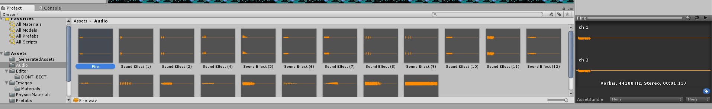

## Audio

An often neglected part of prototyping is adding **Audio** to your game. This is unfortunate since most **Audio** will be easy to add, but has a suprisingly positive impact on how your game plays.

### Downloading and Adding a Sound Effect.

So far we've just been using **Assets** that were included in the **Unity Package**.  However, it will generally be your responsibility to find these on your own.

Begin by going to [sounds-resource.com](https://www.sounds-resource.com/) and searching for [Metroid](https://www.sounds-resource.com/nes/metroid/).

Under the Sound Effects tab click the one that's available: [Sound Effect](https://www.sounds-resource.com/nes/metroid/sound/4866/).

Click **Download Zip** and use your favorite unzipping tool to open the folder. Now we have a number of (unfortunately unnamed) Sound Effects you can use.

Create a new **Audio** folder and drop **all** of these files in. While we're just going to add the **shooting** sound effect in this tutorial, it will be useful to have all of these once you start working on the other sounds.

Rename **Sound Effect (3)** to **Fire** as it will be the effect we use. At some point you may want to rename all of the Sound Effects you'll need, but it will be up to you to figure out the rest of them.



Didn't I just tell you it will be up to you to find your other assets? Google is an invaluable tool.

<a href="http://www.metroid-database.com/m1/music.php">That being said, you're still reading these expandable sections and I appreciate that, so take this. You'll need Brinstar and ItemRoom (for the last two rooms). You may also want a third track for your custom level.</a>


### Setting up

Begin by adding an **AudioSource** component to the **Bullet Prefab**

Update the **Source** to our new **Fire** sound effect.

Ensure that **Play On Awake** is **True** (This should be the case here, but note that sometimes you many not want this).



In this case, we were able to just use PlayOnAwake, but sometimes you'll need to use more complex logic and call Play() in the AudioSource component.

You'll find that something like the walking Sound Effect will actually be a bit of a challenge to script well.

It should also be noted that the solution we did here, while simple, isn't actually faithful to the original game. The sound effect stops if the bullet is destroyed while it is playing. It may make more sense to have the AudioSource on something like the Player, playing it through scripting.



### Conclusion

That's it for adding our Sound Effect, see how easy it is?

When you're ready, commit your changes and head over to [11: Morph Ball](./11-MorphBall).