## The Morph Ball

The **Morph Ball**, and any type of **State Behaviour**, can be one of the toughest things to do well as a beginner. This year we're going to help you get started with it.

### Creating the Game Object

If you'll recall, the reason we were implementing part of the player in **Standing** instead of all in **Player** was so that we could switch states by disabling **Standing** and turning on another **Game Object**. Now it's finally time to do that.

Start by **Disabling** **Standing**. We'll turn it back on later, don't worry.

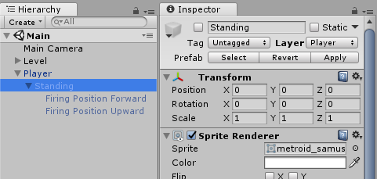

Create a new **Game Object** named **Morphed**. Add it as a child to **Player** and set the **local position** to **(0, 0, 0)**.

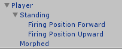

Add a **SpriteRenderer** with **Sprite**: **metroid\_samusaran\_sheet_3**

Add a **SphereCollider** with **Radius**: **.45**. Also set the **Material** to **Frictionless**.



Our ball isn't actually going to roll on the ground in this game, but slide just like the Standing Capsule Collider.

Besides, to be faithful to the real Metroid you're going to want to not rotate the ball on the z-axis, but change between the 4 rolling sprites. If you don't want to deal with Sprites though you could also just rotate in 90 degree increments, it's your call.

One last thing to point out though is that while you want this to be frictionless, you may want it to differ from the current material and also be slightly bouncy too. Try creating a new Physic Material and playing around with the Bounciness parameter.



And our ball is ready to go. If you play the scene you'll see that our Player is fitting nicely in 1 tile tall spots. However, despite being in ball form our player is still able to jump.

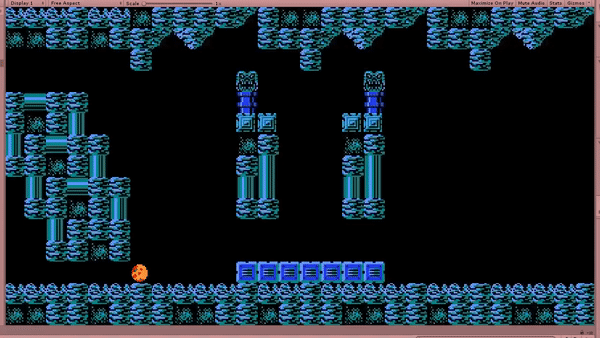

### Decoupling Jumping

To limit jumping to just **Standing** we are going to break our single **PlayerMovement** script into two scripts: **PlayerRun** and **PlayerJump**.



You could, but you should always use a better long term solution when one is available.
 

In this case it's separating unrelated functionality. Horizontal movement has nothing to do with jumping, so they should be two separate components.



Create **PlayerJump.cs** and place it in your script folder. Move all of the jump functionality from **PlayerMovement** over into it. Be careful with your **GetComponent()-esque** calls. The **RigidBody** is now in the parent, and the **Collider** is now on this object. You can now also safely cache the **Collider** since you know it won't change.

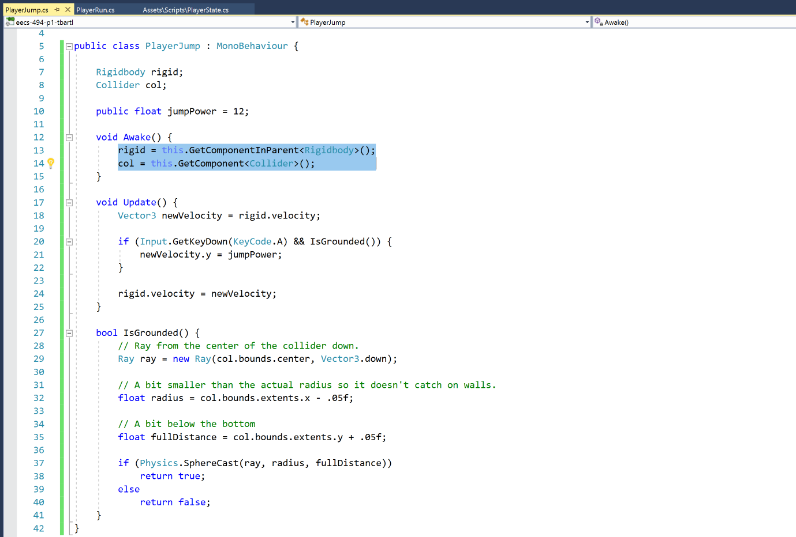

Now rename **PlayerMovement.cs** to **PlayerRun.cs**. It should be pretty simple without jump logic, but make sure you rename the class within the script as well!

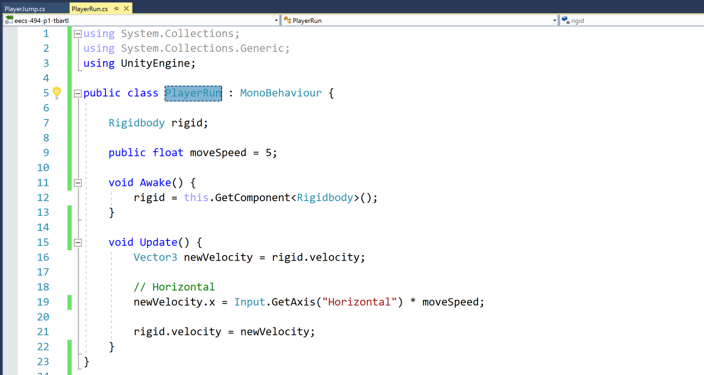

Now as both **states** allow for **"running"**, make sure that the **component** is part of **Player**:

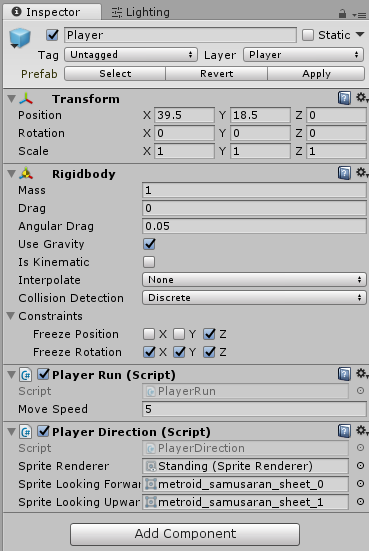

**Jumping**, on the other hand, should only work when the player is **Standing**, so add the component to it.

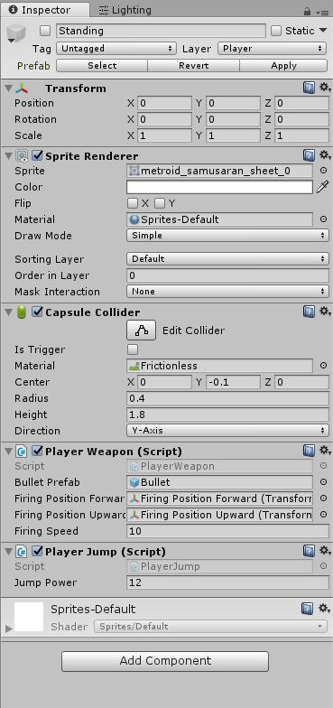

Great, we've decoupled our code. Plus we didn't have to add any new logic and yet our states work correctly.



It shouldn't be harder! You can either simply GetComponent for the other scripts, or just check the Rigidbody's velocity on the other axis when you want to check if the player is running or jumping.



### Switching States

Up until this point, we had been manually enabling and disabling **Standing** and **Morphed**. Now we are going to write a simple script to let the **Player** switch between both states.

Create a new script, **PlayerState.cs** in your **Assets/Scripts** folder. Add it to your **Player** object.

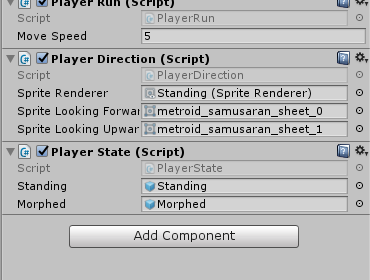

The logic for this should be pretty straightforward. You have your two child **GameObject**s, and only one should be enabled at any given time. The player can switch to **morphed** form by pressing **Down Arrow** and switch to **standing** when pressing **A** or **Up Arrow**. 

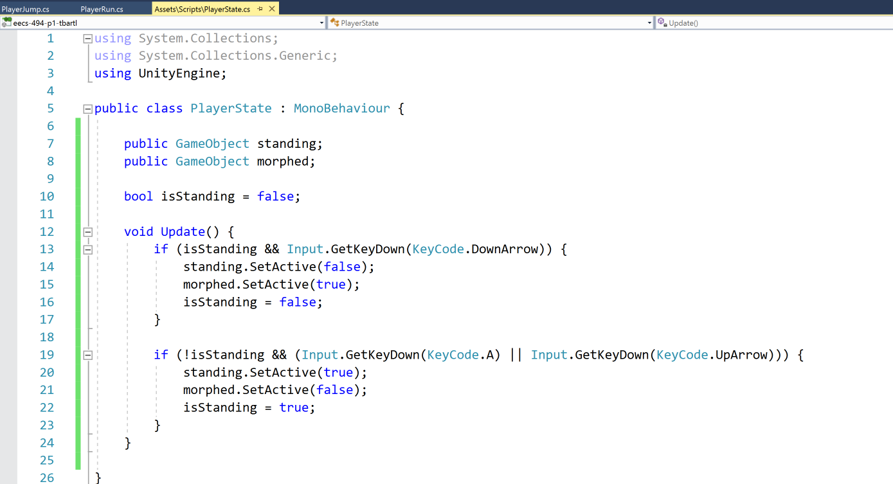

As always, we need to setup our **public** variables. Drag the children into the fields to set the reference.

Finally, let's enable **Standing** and disable **Morphed**.

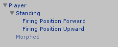

And our simple state machine is done!



Yes you should! You already have logic for checking if you're grounded (though it's currently only available in PlayerJump). As for standing, you can probably do a similair spherecast up to see if there's space.





That's true! There are a lot of ways you could abstract this to make it more extendable. If you decide to add more states it might be a good idea to do this.

But... there are a few programming principles that you can benefit from following: YAGNI (You Aren't Gonna Need It) and KISS (Keep It Simple Stupid). Generally students have the opposite problem though: implementing things without any care.

Too little modularity can be a bit of a problem though, as you saw when we had to decouple jumping from running.



### Conclusion

That's it for the Morph Ball. Of course, the Player doesn't start with access to the Morph Ball, so in the next tutorial we're going to force them to pick it up first.

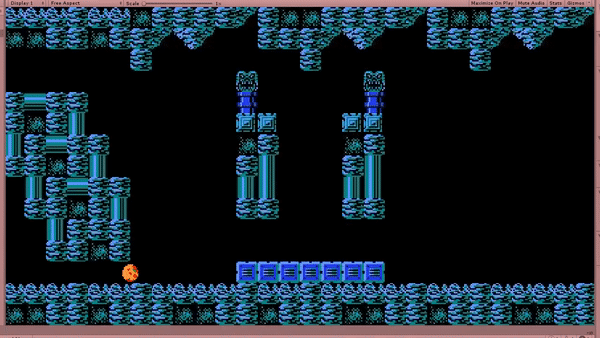

When you're ready, commit your changes and head over to [12: Collectables](./12-Collectables).