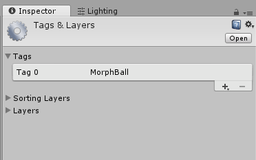
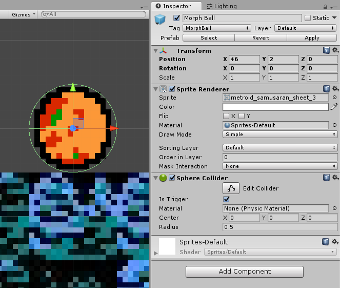
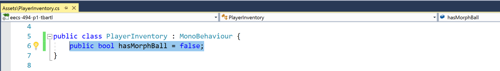
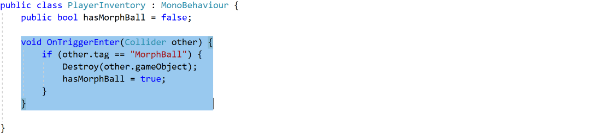
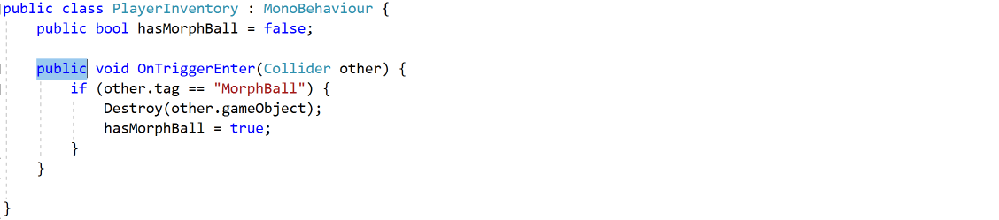
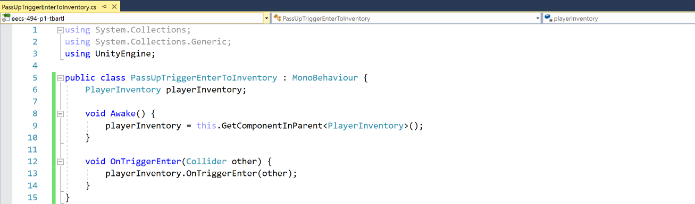
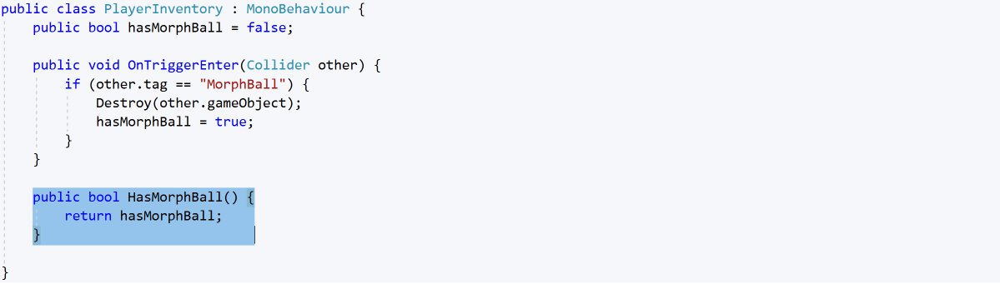
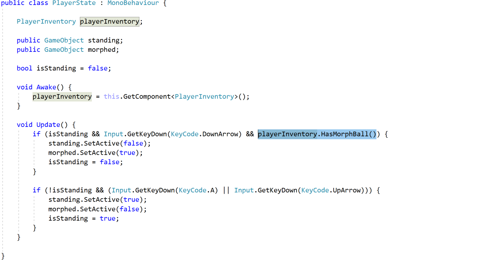

## Collectables

In **Zelda**, a huge part of the project is maintaining an inventory. Thankfully for us, **Metroid** doesn't have all this work (we did have to spend a lot of extra time on physics though).

In this final section, we're going to implement the **Morph Ball** and implement a simple **inventory**.

### Creating the Pickup

Create a new **GameObject** named **Morph Ball**.

Make it a **Child** of **RoomA** (remember, we want our **Collectables** and **Enemies** to be children of **Room**s so they're disabled with them).

Set the **Local Position** to **(46, 2, 0)**. This isn't the actual position of the collectable, but a moving Camera isn't part of this tutorial so you wouldn't be able to see it in its real position.

Add a **SpriteRenderer** with **Sprite**: **metroid\_samusaran\_sheet\_3**



You've got a keen eye. The real MorphBall flickers between two vibrantly colored sprites.

As with all of the Assets you'll now need, it's up to you to find these correct sprites on your own!



Add a **SphereCollider** with **Radius**: **.5** and **IsTrigger**: **True**.

We don't need to worry about a **Rigidbody** since this will never move!

The last thing we need to do is give the Game Object a **Tag** so the **Player** can check to identify the **Trigger**.



Names can be messed up by Unity in some cases. Instantiating a new object will append "(Clone)" to the end, and duplicating an object will append a number to the end. Tags don't have this problem.



Go to the **Tags & Layer Manager** under **Edit->Project Settings->Tags and Layer**. Add a new **Tag** named **MorphBall**.

Give this tag to your **MorphBall GameObject**.

That's it! Our **Player** will handle the rest of the logic for picking this up. Convert this to a **Prefab** by dragging the object from the Inspector into the **Prefabs** folder.



As I said with the Player prefab, you may decide you want to use the Morph Ball in different scenes (Either your custom level or any test scenes).

Plus it will be good to have all of your Collectables in one spot to change them without finding them in your scene.



### PlayerInventory

Now let's create a simple script to manage the **Player**'s **Inventory**. Create a script named **PlayerInventory.cs** in the **Scripts** folder and attach it to the **Player** Object.

Create a **public bool** to keep track of if the player has a morph ball.



Yep! But you can add these later once you start working on the other Collectables.





Good question! It would seem like the Morph Ball should always default to false so it shouldn't need to be set in the inspector.

As you're building your project, you might find it a pain to pick up the Morph Ball every playthrough. Instead, you can just turn this on in the inspector and you won't have to waste your time grabbing it. Just make sure to turn it off before your builds though.

An even better solution would be to make a Cheat Manager that turns this on, and you may consider this when you implement the other cheats we require.



Now we need to check for the **Player**'s Collision with the **MorphBall**. In an **OnTriggerEnter()** function, check the **Collider**'s **Tag**. If it matches **"MorphBall"** destroy the object and set **hasMorphBall** to **True**. 

Unfortunately, we aren't picking up the ball just yet. Bugs like this are super frequent with Beginner Unity development. Did we set the **Tag** wrong? Is our syntax for **OnTriggerEnter()** bad? Did we set up the **Collider**s correctly?

In this case, **OnTriggerEnter()** is never being called. This is because our **Player** object doesn't have a **Collider**, the **Children** have the **Colliders**.

So we need to call the **Parent** **OnTriggerEnter()** whenever the Child **OnTriggerEnter** is called.

First expose the **OnTriggerEnter** call by making it public.

Create a new script **PassUpTriggerEnterToInventory.cs** in the **Scripts** folder and attach it to **both** **Standing** and **Morphed**.

In this script you should first store a reference to the **PlayerInventory**. Then pass up the **Collider** when this object hits a trigger.

### Restricting State Changes

The last thing we need to do is have the **PlayerState** script check the inventory before it lets the **Player** morph.

First let's add a **Getter** in **PlayerInventory.cs** for if the player has the **MorphBall**.



While this variable is public to make it easier to debug, we should still apply good coding practices and assume it's private.



Now in **PlayerState.cs** store a reference to the inventory and check the **playerInventory** before allowing a morph.

### Conclusion

You've made it! You are now officially done with the Metroid tutorials. Don't celebrate too much though as you still have a lot of work ahead of you.

When you're ready, commit your changes and head over to [13: Next Steps](./13-NextSteps).