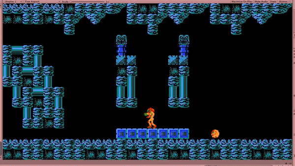

## Welcome to the EECS 494 Metroid Template Tutorial Series

In these tutorials, we aim to help you get started on your classic Metroid game project. 

As you go through these tutorials, make sure you're following along in your own project so that once you finish you'll be setup and ready to tackle the project on your own.

By the end of these tutorials you will have a basic scene setup with a basic implementation of the player. More importantly though, you will understand many of the concepts you'll need to finish the rest of the project on your own.


[You can view the results of the tutorial in this Unity Web Player Demo](./Demo)


We expect these tutorials to take approximately 1.5 hours to complete, but they are sectioned so that you can stop and review at any time.

Whenever you see a gray block, you can click to expand it and get more information.

 
  
Exactly like this, and exactly like that.



 
  
Technically, this whole tutorial is optional if your group is confident that you can do the project on your own.

  
Technically, doing this whole project is optional, but it will be reflected in your GPA.

  
These extra sections, along with the rest of the tutorial, are here to help save you a lot of time. We strongly encourage you take take full advantage of them.



 
  
Both projects are fairly equal in the challenges you'll face. The biggest difference between the two is Metroid's focus on tight platforming (and the challenges that presents to implementing physics) and Zelda's focus on inventory (and the challenges that presents to implementing UI).

  
The other major difference is how the tutorials are presented. Traditionally both tutorials were presented as long videos, but this year we're trying something a bit different with having the Metroid tutorial be mostly text.

  
In terms of effort, both projects are structured to take around the same amount of time.



 
    
We've intentionally made all included code in image form only. This is partially because we want to keep the amount of work consistent with the Zelda video tutorials, but mostly because there's value in being forced to type all the code.



When you're ready to get started, go to the first tutorial: [1: Project Setup.](./01-ProjectSetup)

### Tutorial List

[1: Project Setup](./01-ProjectSetup)

[2: Scene Setup](./02-SceneSetup)

[3: Placing Tiles](./03-PlacingTiles)

[4: Configuring Tiles](./04-ConfiguringTiles)

[5: Player Setup](./05-PlayerSetup)

[6: Player Movement](./06-PlayerMovement)

[7: Player Movement Fixes](./07-PlayerMovementFixes)

[8: Player Direction](./08-PlayerDirection)

[9: Bullets and Firing](./09-BulletsAndFiring)

[10: Audio](./10-Audio)

[11: Morph Ball](./11-MorphBall)

[12: Collectables](./12-Collectables)

[13: Next Steps](./13-NextSteps)
